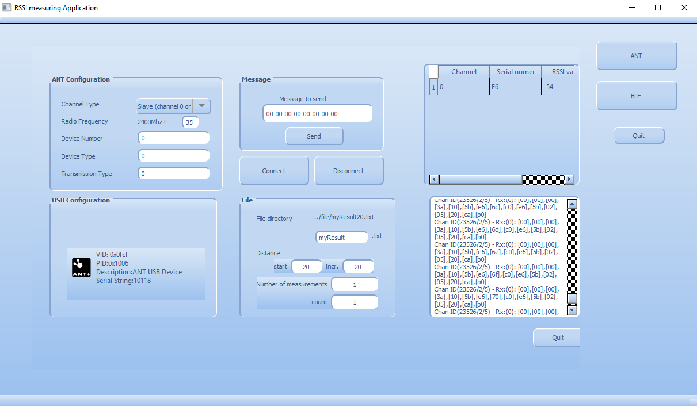

# Student project: Indoor localization based on two RF technologies: BLE and ANT (2018)

# Overview
Firmwares and a GUI software designed for evaluating two RF technologies: ANT and BLE.

# Prerequisites
-   [D52QM6 SoC modules](https://www.thisisant.com/developer/components/d52)
-   [nRF52 DK](https://www.nordicsemi.com/Software-and-tools/Development-Kits/nRF52-DK/Getting-Started)

-   [Qt](https://www.qt.io)
-   [SEGGER J-Link](https://www.segger.com/downloads/jlink/) 
-   [Keil MDK (nRF_DeviceFamily)](https://developer.nordicsemi.com/nRF5_SDK/pieces/nRF_DeviceFamilyPack/)

# Installation

`git clone https://github.com/xuanjiao/ANT_BLE_localization.git`

# Usage

## The basic setup 
The picture below is a basic experiment setup. This set up can collect received signal strength indicator (RSSI) value at different distances ranging from 20 cm to 5 m. To reduce the experimental variates, it is recommanded to perform the experiment in a large empty lab space without obstacles. 
-   A beacon (D52QM6 SoC) periodically sends messages. 
-   A base station (nRF52 DK) connected to a laptop via USB. It measures the RSSI values.

## The advance setup

## Fingleprinting Localization based on RSSI value
For more details please refer to the poster abstract [PDF](Doc/ANT_Poster.pdf)
or [ACM digital library](https://dl.acm.org/doi/10.1145/3274783.3275217)

## Experiment: Capture ANT RSSI value at different distances.

1. **Flash the firmwares**. 

    We nRF52 DK as base station, SoC(D52QD2M6IA-A) as nodes. Then we use programming tool ''nRF52go Studio'' to flash firmwares (softdevice and application) for the base station and the nodes.

For the base station:
-   Softdevice: ''gcc_ANT_firmware_212/base/ANT_s212_nrf52_1.0.2.hex''
-   Application: ''gcc_ANT_firmware_212/base/ant_network_processor_s212.hex''

For the nodes:
-   Softdevice ''gcc_ANT_firmware_212/node/ANT_s212_nrf52_5.0.0.hex''
-   Application: Choose one file in path gcc_ANT_firmware_212/ from RF2450.hex (ANT channel 0) to RF2520.hex (ANT channel 7)

2. **Open the GUI software in laptop.**

The above figure shows the main window of GUI software. Click ''ANT''bottum to open the ANT widget.

3. **Start the experiment**. Turn on the beacon and click ''Connect'' bottom in GUI application. If the base station is recognized, its VID and PID show in the left text view. In addition, the received messages was shown in table view and right text view. The ''count'' value was 1. The measuring result was stored in a txt file.
-   Txt file: ''host_PC/file/base name start distance.txt'' (E.g. ''host_PC/file/myResult 20.txt'')

4. **Finish the experiment**. Turn off the beacon. The base station recognized its absence and the text view printed ''RX Fail'' and ''Go to Search”. The application quit when reach maximal number of measurement, .

5. **Set up the next experiemnt** Move the beacon to next destance (start distance + Inc.). Turn on the beacon after ”Go to search” was printed. The count value pulsed 1. Now the measuring result was store in a new txt tile (E.g. ''host_PC/file/myResult 40.txt'').

6. **Repeat Step 3-5**

## Experiment: Capture BLE RSSI value at different distances.

1. **Flash the firmwares**. 
The folder ''keil_ble_firmware_312'' is a keil project located in nRF52 SDK. Flash ''keil_ble_firmware_312/_build/nrf52832_xxaa.hex'' to the beacon.

2. **Open the GUI software in laptop.**
Click ''BLE''bottum to in the main window to open the BLE widget.

3. **Start the experiment**. 
Turn on the beacon and click ''Connect'' bottom in GUI application. The received messages was shown in the text view. 

4. **Finish the experiment**.
Turn off the beacon. 

5. **Set up the next experiemnt** 
Move the beacon to next destance (start distance + Inc.). Turn on the beacon. The count value pulsed 1. Now the measuring result was store in a new txt tile (E.g. ''host_PC/file/myResult 40.txt'').

6. **Repeat Step 3-5**

