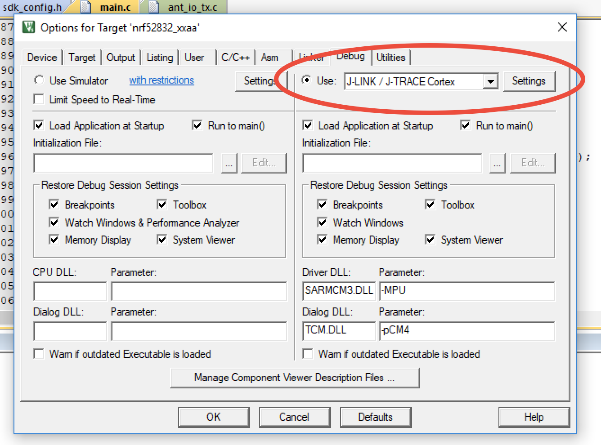

### Table of Content
1. Introduction
2. Project description  
  - 2.1. Indoor localization based on radio technolodgy  
  - 2.2. ANT protocol  
  - 2.3. BLE protocol
3. Methodology
  - 3.1.ANT scenario description  
    - 3.1.1. ANT beacon  
    - 3.1.2. ANT base station  
    - 3.1.3. ANT channel  
  - 3.2. Steps to set up ANT communication
    - 3.2.1. Requirements  
    - 3.2.2. Step 1: Implement GUI application for host PC  
    - 3.2.3. Step 2: Choose proper soft device for ANT beacons
    - 3.2.4. Step 3: Implement application with SDK for ANT beacons  
    - 3.2.5. Step 4: Measure the RSSI value
    - 3.2.6. Step 5: Get the RSSI-Distence equation (to do)
  - 3.3. BLE scenario description   
    - 3.3.1. BLE beacons
    - 3.3.2. BLE base station
    - 3.3.3. BLE communication
  - 3.4. Steps to set up BLE communication  
    - 3.4.1. Requirements  
    - 3.4.2. Step 1: Implement application for BLE base staion
    - 3.4.3. Step 2: Implement application with SDK for BLE beacons  
    - 3.4.4. Step 3: Install RTT viewer
    - 3.4.5. Step 4: Measure the RSSI value
    - 3.4.6. Step 5: Get the RSSI-Distence equation (to do)
4. Results
5. Conclusion
6. Reference

# Project Report

## Introduction

## Project description

#### Indoor localization based on radio technolodgy

#### ANT
ANT is a ultra low power wireless protocol. It is suited for multiple topologies: peer to peer, star, tree, mesh. It is a good solution for local area network(LAN). For example, smart home and automation Industries. ANT technology supports the use of any of the available 125 unique RF operating frequencies on 2.4Hz frequency band (2400MHz - 2524MHz)
### BLE
BLE (Bluetooth Low Energy) is designed for low power network. It support peer to peer and broadcast, and mesh topologies. BLE operates on 2.4GHz frequency band. BLE uses frequency-hopping spread spectrum method. During the transmission, the radio signals switch among many frequency channel.

The table shows a detailed comparison between ANT and BLE protocol on NRF module

Table 1: comparison between ANT and BLE

## 3. Methodology

#### 3.1. ANT scenario description

Figure 2 ANT topology

  

##### 3.1.1. ANT beacon  
The ANT beacons are the masters which initiate communication. They are assigned to different frequency channel. The ANT beacons broadcast its serial number and its channel ID with designated channel period (shown in figure 4). In this project, ANT beacons are ANT SoC (Figure 3) `D52QD2M6IA-A`.

Figure 3: ANT layers

##### 3.1.2. ANT base station
 The ANT base station is the slave which receives the broadcast messages. It establish multiple channels (maximal 8 channels). Each channel is assigned to one Radio frequency and one beacon's channel ID. This make sure listen to the broadcast of only one device. In this project, ANT base station is the ANT MCU (Figure 3)`D52QD2M6IA` connected to host PC through.USB interface board.

For more detail please refer to 3.2. Steps to set up ANT communication.

 *RSSI measuring in ANT base station*

 If "Extend Message" is enabled, ANT base station will provide its host application with additional information regarding the received data message. including received signal strength indication (RSSI)(shown in the figure 4, step 8 receive messages).

 >Channel ID ——a 4 byte value that contains 3 fields: Transmission Type, Device Type (including pairing bit) and Device Number.
  - Device Number
    - A 16-bit unique ID for ANT beacons.
    - The device numbers of ANT beacons are their serial numbers.
  - Device Type
    - To denote the type (or class) of device.
   - Transmission Type
    - To define certain transmission characteristics of a device
 * Radio frequency
     - RF frequency value = (desire frequency - 2400MHz)/ 1MHz

##### 3.1.3. ANT channel
 In this project we use synchronous, independent, bidirectional channels. In each ANT channel, only one master(transmitter) and one slave(receiver) is allowed. E.g. In the figure 2, channel 1 is establish between beacon 1 and base station.

 Figure 4: ANT base station step 1 configure

  

  Table 2: Serial message format: ANT base station -> Host PC

  | Byte 1 | Byte 2 | Byte 3 - N|  Byte N + 1| Byte N+2 |
  | :------------- | :------------- |
  | Sync | Msg Length | Msg ID | Message Content | Check sum

Message format (Channel ID and RSSI enabled)

Figure 5: ANT base station step 2 listening

  

Table 3: Message format: ANT beacon -> ANT base station

| Byte 0 | Byte 1 | Byte 2 | Byte 3 | Byte4 | Byte 5 - 12 |Byte 13 | Byte 14 | Byte 15 | Byte 16 | Byte 17 | Byte 18 | Byte 19 |
| :------------- | :------------- |
| Sync  | Msg Length | Msg ID | Channel Number|Payload (serial number) | Flag (0xC0)|Device Number|Device Type| Transmission Type | Measurement Type | RSSI value | Threshold Configuration Value | Check sum

Figure 6: ANT base station step 3 close channel

  

#### 3.2. Steps to set up ANT communication

##### 3.2.1. Requirements

Use Hardware:
* nRF52 DK
* ANT SoC Module: D52QD2M6IA-A (beacons)
* ANT SoC Module: D52QD2M6IA (base station)
* ANTUIF1: USB interface board with a Molex socket
* ANTBAT3: Combined battery and I/O board with a Molex socket, a reset button, I/O
* ANTUSB-M: ANT USB dongle

Use software:
* Mac OS 10.13
* Windows 10 virtual machine
* nRF Studio
* QT creater
* ARM Keil MDK 5
* ANT USB1 Driver - Windows 1.2.40.201
* Microsoft Vitual Studio 2017
* soft device: ANT_s332_nrf52_5.0.0.hex
* nRF SDK: nRF5_SDK_14.2.0.hex
* ANT PC SDK  3.5
* ANT Mac SDK 3.5

##### 3.2.2. Step 1: Implement GUI application for host PC

1. Download ANT PC SDK. link https://www.thisisant.com/developer/resources/downloads/#software_tab

2. open ANT libraries solution in Microsoft Vitual Studio 2017.

3. Build the solution and get library files `ANT_LIB.lib`,`DSI_SiUSBXp_3_1.dll`,`DSI_SiUSBXp_3_1.dll`.

4. Other library file: `C:\Program Files (x86)\Windows Kits\10\Lib\10.0.17134.0\um\x86\User32.Lib`

5. implement an application on QT Using these library files. The structure of the application is shown in figure 8.

6. Deploy the applicaion to a .exe file.

Figure 7: ANT GUI Application window

###### How to use ANT GUI application

Please refer to 3.2.5. Step 4: Measure the RSSI value

###### Diaguram for ANT GUI application

Figure 8: ANT GUI Application window

##### 3.2.3. Step 2: Choose proper soft device for ANT beacons

Please refer to IC revisions, SDK, and SoftDevice compatibility matrix for nRF52832
link:  http://infocenter.nordicsemi.com/index.jsp?topic=%2Fcom.nordic.infocenter.nrf52%2Fdita%2Fnrf52%2Fnrf52_comp_matrix.html

To make sure the ANT and BLE application based on same soft device, we use SoftDevice S332 v5.0.0 and nRF5 SDK 14.2.0.

##### 3.2.4. Step 3: Implement application with SDK for ANT beacons

The following step shows how to implement a ANT application using Keil.

1. Download nRF5x-MDK-Keil Family pack and install it.
2. Connect a ANT SoC(D52QD2M6IA-A) to nRF 52 DK. And connect nRF52 DK to the host PC.
3. If SDK is missing, SDK install window will automatic pop out. User should install all SDK packets for nRF52 DK.
4. Create a new project called ANT beacon project.
5. Go to Project -> Option for Target... and configure you target as follow.
6. Write program for ANT beacon project according to the work flow (figure 9) and compile it

Figure 9: Keil configuration 1

Figure 10: Keil configuration 2

Figure 11: Work flow for ANT beacon project

##### 3.2.5. Step 4: Measure the RSSI value

The following step shows how to measure RSSI value for one ANT beacon in different distance.

###### Preparation on ANT beacons
1. Connect a ANT SoC(D52QD2M6IA-A) to nRF 52 DK. And connect nRF52 DK to the host PC.

1. Open application "nRF studio" in host pc and flash `ANT_s332_nrf52_5.0.0.hex` on the beacon(SoC).

2. go to application tab and flash application .hex file( found in `_build` folder of Keil project ) on the beacons.
   another option: open Keil project and click "Load" icon to flash the ANT beacon project

3. Place an ANT beacon in desired start distance.

###### Preparation on host PC

The following step shows how to Compiling and flashing the project onto the DK.

1. Connect a ANT SoC`D52QD2M6IA` to nRF 52 DK. And connect nRF52 DK to the host PC.

2. go to soft device tab and flash ANT soft device `ANT_s332_nrf52_5.0.0.hex` on the ANT base station(SoC).

3. Download `NordicSemiconductor.nRF_DeviceFamilyPack.8.17.0` and install it.
https://www.nordicsemi.com/eng/nordic/Products/nRF52832/nRF5x-MDK-Pack/48740

4. Download `Network Processor Source Code`. Build this project and get  `ant_network_processor_s332.hex`.
link: https://www.thisisant.com/developer/resources/downloads/#software_tab

5. Open application "nRF studio" in host PC

6. go to application tab and flash application .hex file `ANT network proccessor S332`

The following step shows how set up GUI applicaion.

7. Open ANT GUI application on the host PC

8. Enter the configuration of the ANT beacons (Table 4). The channel type should be `Slave (channel 0 only)`

9. Enter the base `file name` (e.g.myResult), `start distance` and `number of measurements`.

*Table 4: Default ANT GUI Application configuration for single channel base station*

| Parameter    | value     | description |
| :------------- | :------------- | :------------- |
|  channel type  |  slave ( multi channel)       | each channel listens to  one beacon |
|                | slave ( single channel)|to listen to one beacon|
| Device number  | 0 | wildcard |
| Device Type    | 2 | same as ANT beacon's device type |
| Transmission Type| 5 | same as ANT beacon's transmission type|
| Radio frequency | 50 | desire frequency = 2450MHz |
| USB port | 0 | First USB device connected to PC |

###### Start  measuring

1. Turn on the ANT beacon.

2. Click `Connect` bottom in GUI application.

3. If an ANT base station is recognized, the VID and PID of the ANT base station will be shown in the text view. In addition, the received messages will be shown in Table view and text view. The `count` value should be 1.  The measuring result will be stored in a txt file.  
txt file: `application path/file/<base name>_<start distance>.txt`  
e.g. `application folder/file/myResult_20.txt`

4. Turn off the ANT ANT beacon. The base station will recognize its absence and the text view will print "RX Fail" and "Go to Search". If the `count` value is equal to `Number of measurements`, the application will quit.  

5. Move ANT beacon to next destance (start distance + Turn on the ANT beacon after "Go to search" is printed. The count value will puls 1. Now the measuring result will be store in a new txt tile.
txt file: `application path/file/<base name>_<start distance + increment>.txt`  
e.g. `application folder/file/myResult_40.txt`

6. Repeat step 5-6

### 3.3. BLE scenario description  

In figure 10, the BLE beacons are broadcasters and the BLE base station is an observer. The observer listens to what's happening on the air. The broadcasters advertise but don't receive advertisement. They only use advertising but never establish a connection.

Figure 12: BLE topology

#### 3.3.1. BLE beacons

The BLE beacons are broadcasters. it broadcast its GAP name with a time interval, known as the advertising interval. In this project, the BLE beacons are ANT SoC `D52QD2M6IA-A`.

Figure 13: BLE beacon diagram

>* GAP (Generic Access Profile): GAP is the lowest layer of the Bluetooth stack that an application interfaces with. It includes parameter that govern advertising and connection. e.g. name, address.

#### 3.3.2. BLE base station

The BLE base stations is observer. it continuously scan for BLE beacons since its scan interval and its scan window is set equally. It scan for all beacons in its white list and ignore other BLE device.

>Write list: list of GAP address of BLE beacons.

RSSI measuring in BLE base station

The BLE base station measure the radio signal strength of the advertisement(RSSI), and send RSSI value to host PC.

In this project, the BLE base station is Development kit for nRF52832  called `nRF52 DK`.

####  3.3.3. BLE advertising

### 3.4. Set up BLE communication

##### 3.4.1. Requirements

Use Hardware:
* nRF52 DK
* SoC Module: D52QD2M6IA-A (beacons, same as ANT beacons)
* nRF52 DK (base station)
* ANTBAT3: Combined battery and I/O board with a Molex socket, a reset button, I/O

Use software:
* Mac OS 10.13
* Windows 10 virtual machine
* nRF Studio
* ARM Keil MDK 5
* ANT USB1 Driver - Windows 1.2.40.201
* soft device: ANT_s332_nrf52_5.0.0.hex
* nRF SDK: nRF5_SDK_14.2.0.hex

##### 3.4.2. Step 1: Implement application for BLE base staion

The Keil project configuration is the same as ANT project (figure 9 and figure 10)

Figure 14: BLE base station workflow

##### 3.4.3. Step 2: Implement application with SDK for BLE beacons  

The Keil project configuration is the same as ANT project (figure 9 and figure 10)

Figure 15: BLE beacon workflow

##### 3.4.4. Step 3: Install RTT viewer

1. Add RTT files to Keil project:

Tutorial:
https://devzone.nordicsemi.com/tutorials/b/getting-started/posts/debugging-with-real-time-terminal

2. Download RTT viewer and install it:
https://www.segger.com/products/debug-probes/j-link/technology/about-real-time-transfer/

##### 3.4.5. Step 4: Measure the RSSI value

The following step shows how to measure RSSI value for one BLE beacon in different distance.

###### Preparation on BLE beacon
1. Connect a ANT SoC(D52QD2M6IA-A) to nRF 52 DK. And connect nRF52 DK to the host PC.

1. Open application "nRF studio" in host pc and flash `ANT_s332_nrf52_5.0.0.hex` on the beacon(SoC).

2. go to application tab and flash application .hex file( found in `_build` folder of Keil project ) on the beacons.
   another option: open Keil project and click "Load" icon to flash the BLE beacon project

3. Place an BLE beacon in desired start distance.

###### Preparation on host PC

The following step shows how to Compiling and flashing the project onto the DK.

1. Connect nRF52 DK to the host PC.

2. go to soft device tab and flash soft device `ANT_s332_nrf52_5.0.0.hex` on the nRF52 DK.

3. go to application tab and flash application .hex file( found in `_build` folder of Keil project ) on the BLE beacons.
   another option: open Keil project and click "Load" icon to flash the BLE beacon project

###### Start  measuring

1. Open RTT viewer.

2. Click "start Terminal logging" to begin to store the RSSI value.

3. Turn on the BLE beacon.

4. Turn off the BLE beacon.

5. Move ANT beacon to next destance.

6. Repeat step 3-5.

##### 3.4.6. Step 5: Get the RSSI-Distence equation (to do)

## Reference
* NRF infocenter available protocols
<https://infocenter.nordicsemi.com/index.jsp?topic=%2Fcom.nordic.infocenter.whitepapers%2Fdita%2Fwhitepapers%2Fpdflinks%2Fnwp_005.html>

* Keil MDK5 http://www2.keil.com/mdk5/

* ANT Message Protocol and Usage 5.1
* ANT AN Getting Started with ANT PC Development 1.0
* RSSI Extended Information 1.0
* ANT AN Multi-Channel Design Considerations 2.0
link: https://www.thisisant.com/developer/resources/downloads/#documents_tab

Use ANT libraries:
* ANT PC SDK  3.5
* ANT Mac SDK 3.5
link: https://www.thisisant.com/developer/resources/downloads/#software_tab
